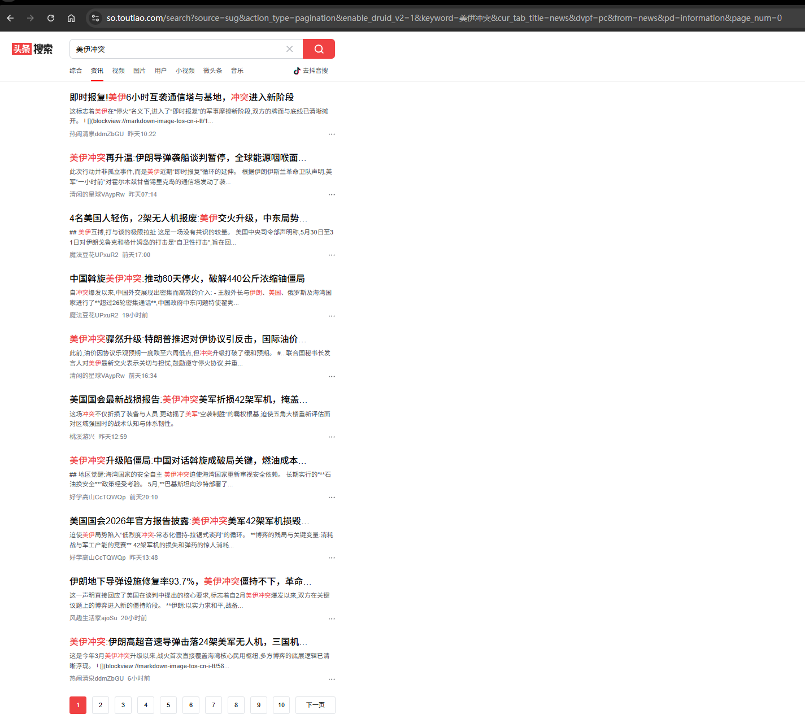
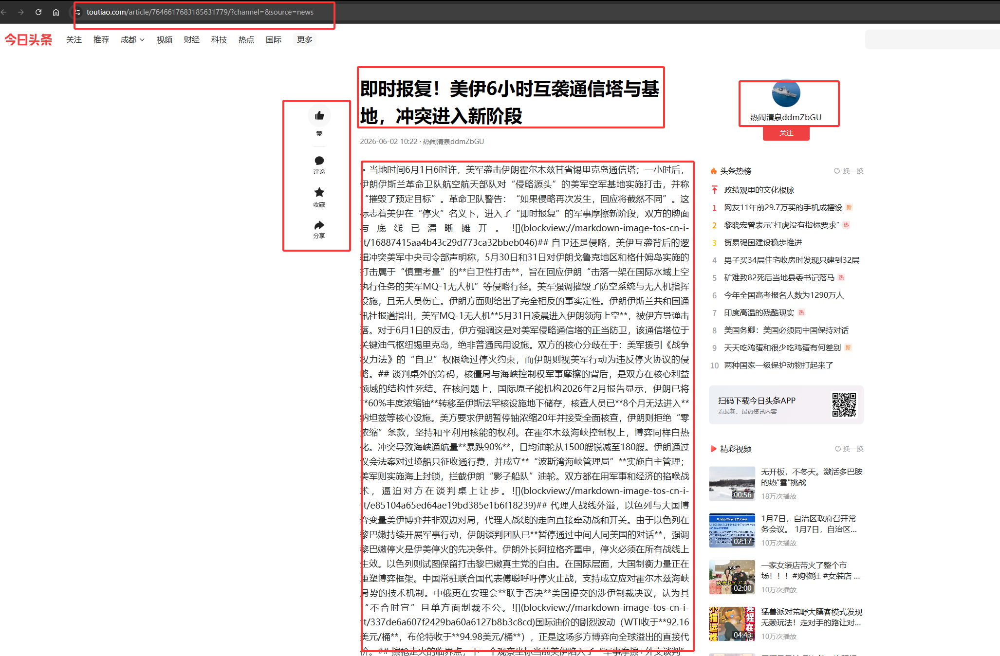

# 今日头条搜索爬虫


一个基于 Python + Playwright 的“今日头条搜索”无头浏览器爬虫工具。

项目会根据搜索关键词打开今日头条资讯搜索页，收集搜索结果中的文章详情页链接，并进入详情页提取标题、正文、发布时间、发布人、点赞数量等字段。目前数据会以 JSON 日志形式输出，适合作为后续数据落库、分析任务或爬虫工程化改造的基础版本。
> 本项目仅做单独的爬虫示例，结合AI大模型数据处理请关注： [toutiao-search-crawler-AI](https://github.com/zhangxiaoxiao9527/toutiao-search-crawler-AI)

## 效果示例


```json
{
    "url": "https://www.toutiao.com/article/7646969515238097460/?channel=&source=news",
    "title": "中金财富期货：当前美伊冲突仍难有结果，黄金被动跟随原油波动",
    "publish_time": "2小时前",
    "author": "齐鲁壹点",
    "like_count": null,
    "content": " 美军中央司令部在社交媒体发文，称伊朗2日在整个中东范围发动袭击，美军拦截若干伊朗弹道导弹和无人机。消息传出后，原油价格回升，涨幅超2%，引发黄金再度调整。美以在开战问题上分歧巨大，特朗普不满内塔尼亚胡暗示除推迟对贝鲁特的袭击外，战争仍在全面继续；而内塔尼亚胡则对特朗普在社交媒体平台发文暗示以色列已在所有战线上 停火“感到沮丧”。当前美伊冲突仍难有结果，黄金被动跟随原油波动，参与难度较大，我们建议观望为主。"
}
```
## 特性

- **关键词搜索**：通过 `--keyword` 指定搜索词，程序自动拼接搜索页面 URL。
- **详情页解析**：提取文章标题、正文、发布时间、作者、点赞数量和文章 URL。
- **跳转链接解析**：支持今日头条搜索页中的多层 `search/jump` 跳转链接。
- **并发抓取**：支持并发访问文章详情页，提高整体抓取效率。
- **动态页面支持**：使用 Playwright + Chromium 执行页面 JavaScript，适配前端渲染页面。
- **调试友好**：支持 headed 模式，必要时可以打开浏览器窗口观察页面状态。

## 技术栈

- Python 3.10+
- Playwright
- Chromium
- asyncio

## 快速开始

### 1. 创建python虚拟环境

```powershell
python -m venv .venv
```

### 2. 安装项目依赖

```powershell
.\.venv\Scripts\python -m pip install -e .
```

### 3. 安装 Chromium

```powershell
.\.venv\Scripts\python -m playwright install chromium
```

### 4. 运行爬虫

```powershell
.\.venv\Scripts\toutiao-search-crawler --keyword "美伊冲突最新进展"
```

macOS / Linux 用户可以使用：

```bash
python3 -m venv .venv
source .venv/bin/activate
python -m pip install -e .
python -m playwright install chromium
toutiao-search-crawler --keyword "美伊冲突最新进展" 
```

## 使用示例


### 指定搜索关键词

```powershell
.\.venv\Scripts\toutiao-search-crawler --keyword "人工智能 最新进展"
```

### 指定搜索数量（默认20）

```powershell
.\.venv\Scripts\toutiao-search-crawler --keyword "人工智能 最新进展" --limit 10
```

### 调整读取详情页并发数（默认4）

```powershell
.\.venv\Scripts\toutiao-search-crawler --keyword "美伊冲突最新进展" --concurrency 10
```

### 打开浏览器窗口调试

```powershell
.\.venv\Scripts\toutiao-search-crawler --keyword "美伊冲突最新进展" --limit 3 --headed
```

## 命令行参数

| 参数 | 说明 | 默认值 |
| --- | --- | --- |
| `--keyword` | 搜索关键词 | `美伊冲突最新进展` |
| `--limit` | 最多抓取的文章数量 | `20` |
| `--concurrency` | 详情页并发抓取数量 | `4` |
| `--delay` | 单个详情页抓取完成后的等待秒数 | `0.8` |
| `--headed` | 显示浏览器窗口，便于调试 | 关闭 |


## 输出示例

程序会将每篇文章以 JSON 日志输出：

```json
{
  "url": "https://www.toutiao.com/article/7646977284758356543/?channel=&source=news",
  "title": "文章标题",
  "publish_time": "3小时前",
  "author": "发布人",
  "like_count": "28",
  "content": "文章正文..."
}
```

字段说明：

| 字段 | 说明 |
| --- | --- |
| `url` | 文章详情页地址 |
| `title` | 文章标题 |
| `publish_time` | 发布时间 |
| `author` | 发布人或来源 |
| `like_count` | 点赞数量，页面未展示时为 `null` |
| `content` | 正文内容 |


## 后续计划

- 支持结果保存到 JSON、CSV 或数据库
- 增加更稳定的分页抓取策略
- 增加失败重试和请求限速配置
- 补充单元测试和字段解析测试
- 分析搜索接口，逐步减少对浏览器渲染的依赖

## 合规声明

本项目仅用于学习和技术研究。使用时请遵守目标网站的服务条款、robots 协议、访问频率限制以及相关法律法规。请勿将本项目用于未授权的数据采集、商业抓取或其他违规用途。

## License

本项目基于 [MIT License](LICENSE) 开源。
